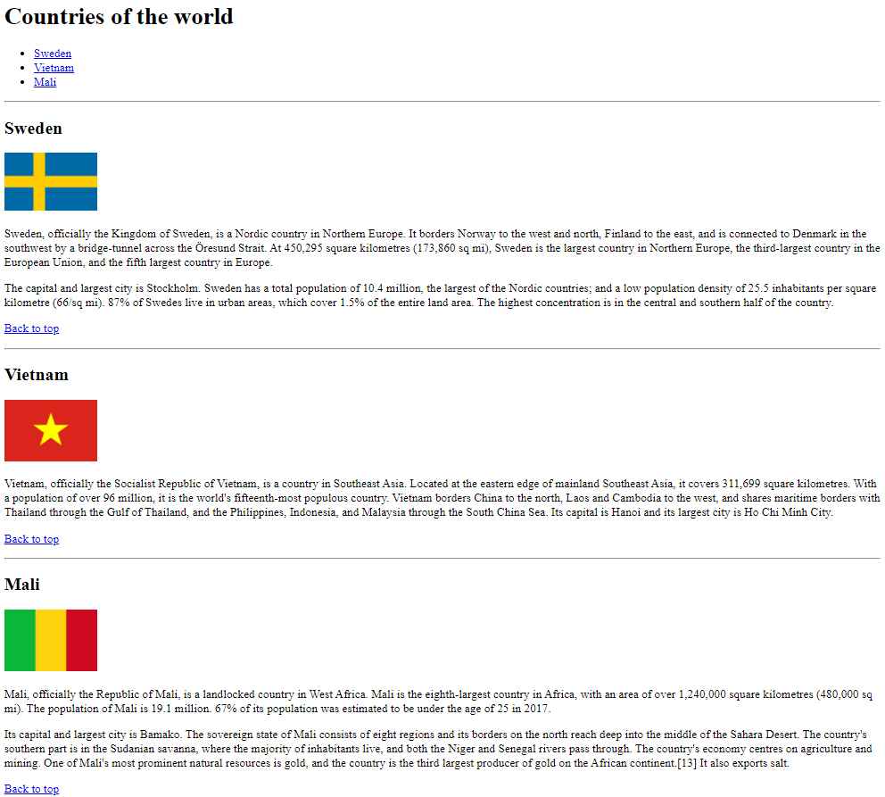
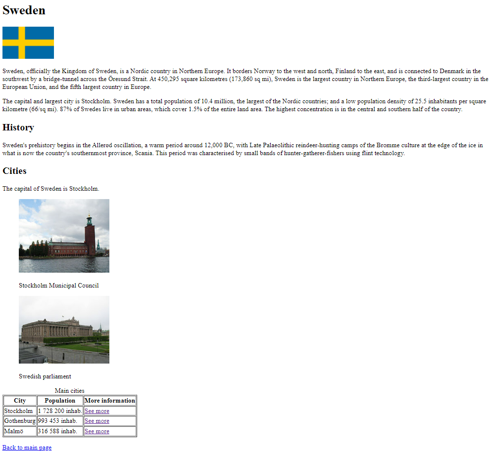

# Countries of the world
See pictures attached to understand what you must create:




You can use Wikipedia to get the text and the images.

Create a main HTML page with the name countries.html and with the following content:
* The ```<title>``` is "*Countries of the world*";
* The main title of the page is "Countries of the world";
* On top, there should be a menu with 3 options/countries – you can choose the countries you want;
* Each country name allows the user to jump to the respective section on the same page;
* Create a section for each country separated by lines;
* Each section has a title (the country’s name), a flag (an image), text (1 or 2 paragraphs) with general
information about the country, and one link, “Back to top”, that allows the user to return to the
menu.
* Each flag has a link that allows the user to access a specific page about the country. For example, for
Sweden, we have a link to the sweden.html page.
Create a page for each of the 3 countries (ex: sweden.html) with the following content:
* The ```<title>``` of each page should be the name of the country;
* The main title of the page is also the country’s name;
* Flag (image);
* General information about the country (1 or 2 paragraphs);
* Section with the History title that has a small summary of the history of the country;
* Some photos from the country or from cities of the country, all with legends;
* Table with the 3 main cities of the country and their population:
o The title of the table should be “Main cities”;
o The three columns should be “City”, “Population” and “See more”;
o The third column should have links to the Wikipedia page about the city, and should be
opened in a different browser tab;
* Link, at the bottom of the page that allows the user to go back to the main page, jumping to the
section about the country.

So, you must create 4 pages:
* 1 main page, with 3 sections, each corresponding to a country – the flags allow the users to access
the specific page about each country;
* 3 “secondary” pages with information and photos about each country.
Every image should have an accessibility attribute with the description of the image. When the cursor hovers
over each image, the description should be shown.
