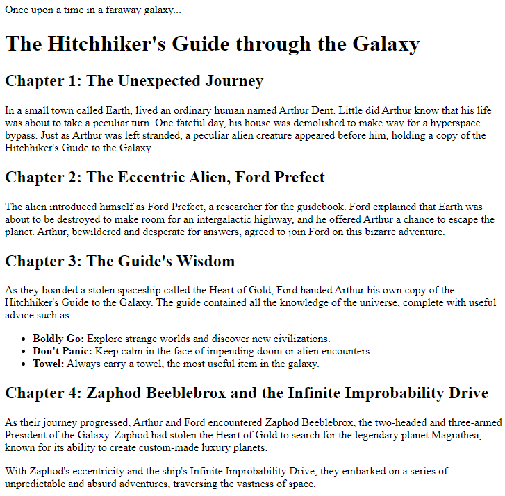
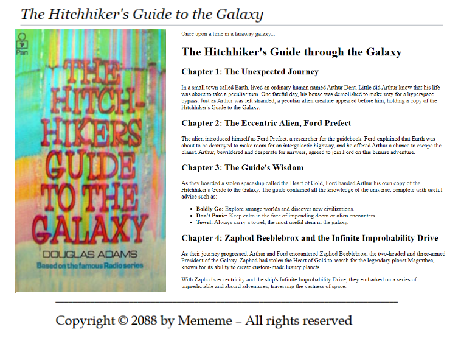

# Text fundamentals
Apply some (or all) elements described on 
[HTML text fundamentals](https://developer.mozilla.org/en-US/docs/Learn/HTML/Introduction_to_HTML/HTML_text_fundamentals)
to the follow text. Paste the result to the right place into the [index.html](html/index.html) page. 
```text
Once upon a time in a faraway galaxy...

The Hitchhiker's Guide through the Galaxy

Chapter 1: The Unexpected Journey
In a small town called Earth, lived an ordinary human named Arthur Dent. Little did Arthur know that his life was about 
to take a peculiar turn. One fateful day, his house was demolished to make way for a hyperspace bypass. Just as Arthur 
was left stranded, a peculiar alien creature appeared before him, holding a copy of the Hitchhiker's Guide to the Galaxy.

Chapter 2: The Eccentric Alien, Ford Prefect
The alien introduced himself as Ford Prefect, a researcher for the guidebook. Ford explained that Earth was about to be 
destroyed to make room for an intergalactic highway, and he offered Arthur a chance to escape the planet. Arthur, 
bewildered and desperate for answers, agreed to join Ford on this bizarre adventure.

Chapter 3: The Guide's Wisdom
As they boarded a stolen spaceship called the Heart of Gold, Ford handed Arthur his own copy of the Hitchhiker's Guide 
to the Galaxy. The guide contained all the knowledge of the universe, complete with useful advice such as:
Boldly Go: Explore strange worlds and discover new civilizations.
Don't Panic:Keep calm in the face of impending doom or alien encounters.
Towel: Always carry a towel, the most useful item in the galaxy.

To be continued...
```
The result might look like this: 



## Link elements
Append a reference chapter and put in a link to the Wikipedia page about the novel: 
[The Hitchhiker's Guide to the Galaxy](https://en.wikipedia.org/wiki/The_Hitchhiker%27s_Guide_to_the_Galaxy)

Also, place a novel picture from the Wikipedia page. When you hit the picture, the above Wikipedia page should open. 


#### Layout structure
Arrange your elements on the page using the documentation under 
[Document and website structure](https://developer.mozilla.org/en-US/docs/Learn/HTML/Introduction_to_HTML/Document_and_website_structure). 
The result might look like this (but nice using [Drop-in minimal CSS](https://dohliam.github.io/dropin-minimal-css/)):


